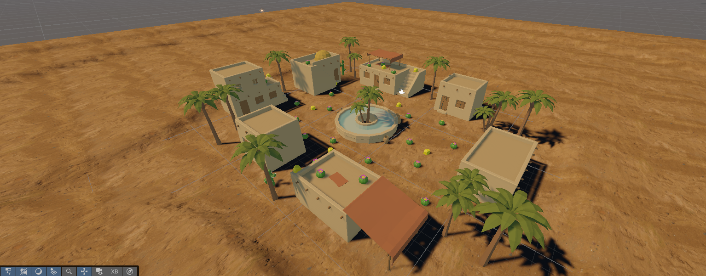

# Escenas Cardboard

- **Alumno:** Adrián García Rodríguez
- **Correo:** alu0101557977@ull.edu.es

## Hello Cardboard

### Descripción

Para iniciarnos en la creación de escenas para las `Google Cardboard` en Unity, se han seguido las instrucciones especificadas en la página [Google SDK](https://developers.google.com/cardboard/develop/unity/quickstart).

En esta primera iteración, simplemente se ha creado el mundo 3D que contendrá nuestra escena, se ha descargado el paquete correspondiente (https://github.com/googlevr/cardboard-xr-plugin.git) y se ha configurado la escena y los ajustes adecuados a fin de compilar exitosamente la aplicación.

### Ejemplo Visual

[](https://youtu.be/1UrhKzmhO9g)

▶️ [Ver en YouTube](https://youtu.be/1UrhKzmhO9g)

## Escena y Assets

### Descripción

Se ha creado una escena con `Cardboard` que tiene un terreno y objetos de diversos paquetes de la `Asset Store`. La escena se inspira en un pequeño pueblo del desierto con elementos típicos de dicho bioma. A continuación, se especifican los `Assets` escogidos:

- [Low Poly Desert Village](https://assetstore.unity.com/packages/3d/environments/low-poly-desert-village-314881)
- [Low-Poly Desert Environment Pack](https://assetstore.unity.com/packages/3d/environments/landscapes/low-poly-desert-environment-pack-333554)
- [POLYDesert](https://assetstore.unity.com/packages/3d/environments/landscapes/polydesert-107196)

### Ejemplo Visual



## Objetos Recolectables

### Descripción

La escena contiene objetos que el `Player` podrá recolectar con la mirada. Al recolectar un objeto, este desaparecerá. Sin embargo, el `Player` no podrá recolectar los objetos que estén a una distancia `mayor de 15 metros`. Estos objetos recolectables, se representan a través de un cactus esférico.

### Script Desarrollado

```c#
using UnityEngine;

public class CollectibleController : MonoBehaviour
{
  public float speed = 2f;

  private GameObject recoveryObject;
  private RecoveryNotifier notifier;
  private bool collected = false;
  private bool recover = false;

  void Start()
  {
    recoveryObject = GameObject.FindWithTag("Recovery Object");
    notifier = recoveryObject.GetComponent<RecoveryNotifier>();
    notifier.OnPlayerGaze += Recover;
  }

  void Update()
  {
    if (recover)
    {
      Vector3 direction = (recoveryObject.transform.position - transform.position).normalized;
      transform.Translate(direction * speed * Time.deltaTime, Space.World);
    }
  }

  public void OnPointerEnter()
  {
    GameObject player = GameObject.Find("Player");

    float distance = Vector3.Distance(player.transform.position, transform.position);

    if (distance < 15 && !recover)
    {
      collected = true;
      gameObject.SetActive(false);
    }
  }

  void Recover()
  {
    if (collected)
    {
      recover = true;
      gameObject.SetActive(true);
    }
  }
}
```

### Ejemplo Visual

[](https://youtu.be/2s5KWfLOH9A)

▶️ [Ver en YouTube](https://youtu.be/2s5KWfLOH9A)

## Movimiento Personaje

### Descripción

Para permitir el movimiento del `Player`, se han dispuesto una serie de objetos interactuables con la mirada. Si el `Player` mantiene la mirada fija sobre uno de estos objetos (`1s` por defecto), el `Player` se teletransportará a la posición de dicho objeto. Esta mecánica resulta útil para desplazarse por el mundo y alcanzar los recolectables que antes estaban fuera de rango. Estos objetos están representados por rocas amarillas (color ampliamente utilizando en los videojuegos para indicar interactividad).

### Script Desarrollado

```c#
using UnityEngine;

public class TeleportTarget : MonoBehaviour
{
  [Tooltip("Time the player must look at the object before teleporting (in seconds)")]
  public float gazeTime = 1f;

  private float gazeTimer = 0f;
  private bool isGazedAt = false;
  private Transform playerTransform;

  void Start()
  {
    playerTransform = GameObject.Find("Player").transform;
  }

  public void OnPointerEnter()
  {
      isGazedAt = true;
      gazeTimer = 0f;
  }

  public void OnPointerExit()
  {
    isGazedAt = false;
    gazeTimer = 0f;
  }

  void Update()
  {
    if (!isGazedAt)
      return;

    gazeTimer += Time.deltaTime;
      
    if (gazeTimer >= gazeTime)
    {
      TeleportPlayer();
      isGazedAt = false;
    }
  }

  private void TeleportPlayer()
  {
    Vector3 newPosition = transform.position;
    playerTransform.position = new Vector3(newPosition.x, newPosition.y + 2f, newPosition.z);
  }
}
```

### Ejemplo Visual

[](https://youtu.be/Lzxv5GkzI8Y)

▶️ [Ver en YouTube](https://youtu.be/Lzxv5GkzI8Y)

## Objeto de Recuperación

### Descripción

En la escena, se encuentra un objeto que permite recuperar los objetos que hasta el momento han sido recolectados. Cuando se mira al `objeto de recuperación`, los recolectables reaparecen en sus posiciones iniciales y se dirigen hacia él. Una vez recuperados, esos objetos ya no podrán volver a ser recolectados.
El objeto de recuperación son `las palmeras de la fuente central`.

### Script Desarrollado

```c#
using UnityEngine;

public class RecoveryNotifier : MonoBehaviour
{
  public delegate void Recover();
  public event Recover OnPlayerGaze;

  public void OnPointerEnter()
  {
    OnPlayerGaze();
  }
}
```

### Ejemplo Visual

[](https://youtu.be/2Fn4e_Nj9zk)

▶️ [Ver en YouTube](https://youtu.be/2Fn4e_Nj9zk)

## GamePlay Completo

[](https://youtu.be/slWh5ohyKqE)

▶️ [Ver en YouTube](https://youtu.be/slWh5ohyKqE)